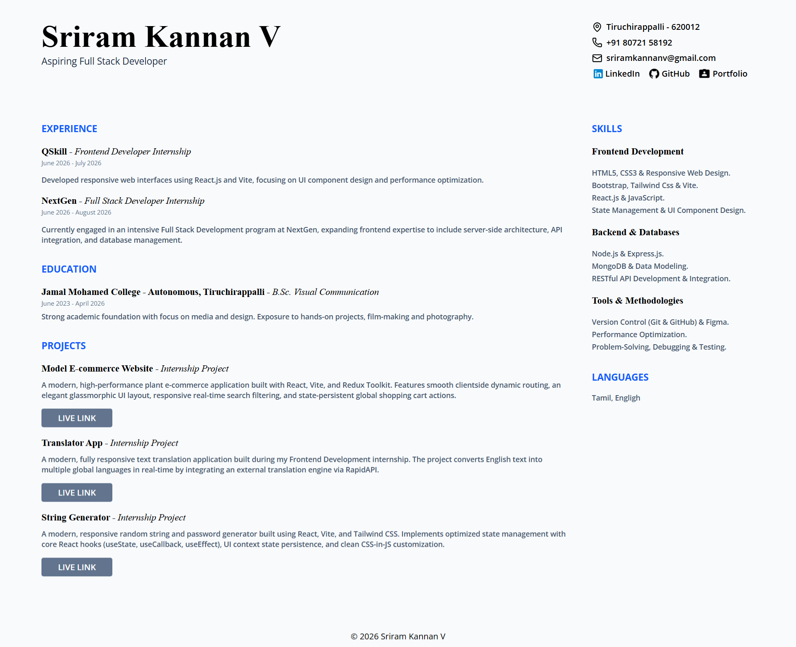

# 📄 Interactive Developer Resume

A modern, responsive, and easily customizable digital resume built to showcase professional experience, projects, and technical skills. Designed with a clean, two-column layout that emphasizes readability and user experience.



## 🌟 Features

- **Clean & Professional UI:** A structured, easy-to-read two-column layout.
- **Fully Responsive:** Adapts seamlessly to desktop, tablet, and mobile screens.
- **Interactive Project Links:** Dedicated project sections with prominent "Live Link" call-to-action buttons.
- **Modern Iconography:** Utilizes sleek, scalable vector icons for contact details and social links.
- **Easy Customization:** Built with modular React components and Tailwind utility classes, making it simple to update content or swap color themes.

## 🛠️ Tech Stack

- **[React.js](https://reactjs.org/)** - UI Component Architecture
- **[Tailwind CSS](https://tailwindcss.com/)** - Utility-first styling for rapid UI development
- **[Lucide React](https://lucide.dev/)** - Clean and consistent iconography
- **[Vite](https://vitejs.dev/)** - Fast frontend build tool

## 🚀 Getting Started

Follow these instructions to get a copy of the project up and running on your local machine.

### Prerequisites

Make sure you have Node.js installed on your machine.

- [Node.js](https://nodejs.org/en/download/) (v16 or higher recommended)

### Installation

1. **Clone the repository:**

   ```bash
   git clone [https://github.com/yourusername/your-repo-name.git](https://github.com/yourusername/your-repo-name.git)
   ```

2. **Navigate to the project directory:**

   ```bash
   cd your-repo-name
   ```

3. **Install the dependencies:**

   ```bash
   npm install
   ```

4. **Start the development server:**

   ```bash
   npm run dev
   ```

5. **Open your browser:**
   Navigate to http://localhost:5173 (or the port provided in your terminal) to view the resume.

### 📫 Contact

**Sriram Kannan**

Email: sriramkannanv@gmail.com
LinkedIn: https://www.linkedin.com/in/sriram-kannan-v-11jan2005/
GitHub: https://github.com/SriramKannanV
Portfolio: https://sriramkannanportfolio.netlify.app/

**Designed and built by Sriram Kannan.**
